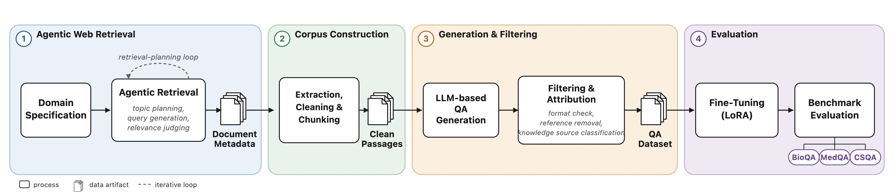
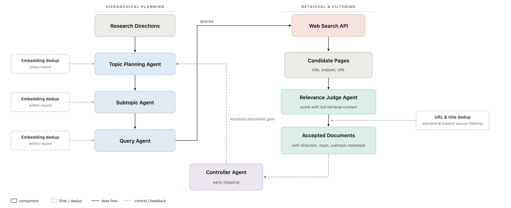
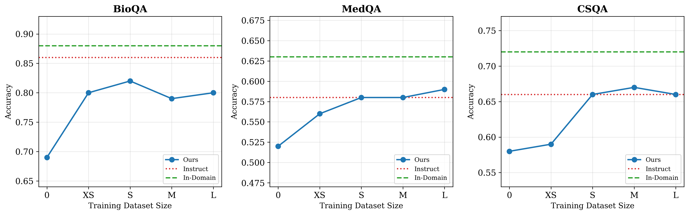

# agentic_web_rag

An agentic web retrieval framework that replaces static corpus retrieval for zero-shot synthetic QA generation and domain-adaptive LLM fine-tuning.

This project was developed as part of my master's thesis at the University of Copenhagen, focused on agentic web retrieval for synthetic data generation and LLM adaptation.

## Motivation

Adapting a language model to a specialized domain usually requires either manually annotated training data, which is expensive and slow to collect, or a pre-existing static corpus, which is often incomplete and quickly becomes outdated. This project reduces both constraints by dynamically constructing a domain-specific corpus from the web and generating synthetic QA pairs without manual annotation.

## What It Does

In practice, this is a low-cost tool for automatically producing domain-specific training data. Given only a set of research directions for a target domain, it builds an evidence corpus from the web and turns it into ready-to-use QA training data. This is useful when:

- You need to strengthen a small model on a vertical domain but have no annotated data and limited budget for annotation.
- The domain changes quickly (medicine, law, recent research) and a static corpus would become stale, while live web retrieval stays current.
- You want to quickly test whether synthetic data improves a model on a given domain, without spending weeks building a dataset first.

## Overview

The system has three core components:

**1. Agentic web retrieval.** A hierarchical multi-agent system plans and executes retrieval. A Topic Planning Agent, Subtopic Agent, and Query Agent expand research directions into concrete search queries. Retrieved pages are scored by a Relevance Judge Agent and filtered, while a Controller Agent monitors coverage and triggers early stopping. This replaces static corpus retrieval with on-demand web search.

**2. Zero-shot QA generation.** Synthetic QA pairs are generated directly from the retrieved corpus without few-shot demonstrations, then filtered for quality.

**3. Attribution analysis.** An LLM-based verification stage checks whether each generated QA pair is supported by the retrieved evidence, improving data quality and reducing unsupported samples.

The resulting synthetic data is used to fine-tune Qwen3-8B via LoRA, evaluated across biomedical, medical, and commonsense reasoning benchmarks.

**Key results:**
- A simpler retrieval pipeline that achieves substantially higher retrieval efficiency than static corpus-based approaches, without sacrificing downstream quality
- Competitive task performance: the fine-tuned base model matches or exceeds its instruction-tuned counterpart on medical and commonsense QA, and stays close on biology
- Strong out-of-distribution generalization on held-out biology benchmarks not seen during training

## Pipeline

### Agentic Retrieval Architecture

## Results

## Repository Structure

\`\`\`
agentic_web_rag/
├── web_retrieval/              # Agentic web retrieval pipeline
│   ├── pipeline.py             # Main pipeline orchestration
│   ├── selector_agent.py       # Agent for selecting relevant web content
│   ├── agentic_retrieval_bio.py   # Domain-specific retrieval (biomedical)
│   ├── agentic_retrieval_med.py   # Domain-specific retrieval (medical)
│   ├── agentic_retrieval_cs.py    # Domain-specific retrieval (commonsense)
│   └── processing/             # Web content processing utilities
├── data_generation/            # Synthetic QA data generation
│   ├── create_prompt.py        # Prompt construction for QA generation
│   ├── create_task_samples_qwen3.py  # Zero-shot QA sample generation with Qwen3
│   ├── sampling.py             # Data sampling utilities
│   └── filtering/              # Post-generation filtering
│       ├── attribution.py      # LLM-based attribution analysis
│       └── regex_checking.py   # Format and quality checks
├── services/
│   └── llm_and_search.py       # LLM inference and search API wrappers
├── train_and_eval/             # LoRA fine-tuning and evaluation scripts
├── requirements.txt
└── LICENSE
\`\`\`

## Installation

\`\`\`bash
git clone https://github.com/<your-username>/agentic_web_rag.git
cd agentic_web_rag
pip install -r requirements.txt
\`\`\`

Set up your SerpAPI key:

\`\`\`bash
cp .env.example .env
# Add your SerpAPI key to .env
\`\`\`

The pipeline also requires a local vLLM server for LLM inference (serving Qwen3-8B). Start it separately before running the pipeline.

## Usage

**1. Run agentic web retrieval:**
\`\`\`bash
python web_retrieval/pipeline.py
\`\`\`

**2. Generate synthetic QA data:**
\`\`\`bash
python data_generation/create_task_samples_qwen3.py
\`\`\`

**3. Fine-tune and evaluate:**
\`\`\`bash
# See scripts in train_and_eval/
\`\`\`

## Models & Benchmarks

- Base model: Qwen3-8B-Base, fine-tuned with LoRA
- Evaluated on: BioQA, MedQA, CSQA
- OOD evaluation: MMLU biology subsets

## Requirements

See \`requirements.txt\`. Key dependencies: \`transformers\`, \`peft\`, \`trl\`, \`vllm\`, \`serpapi\`, \`trafilatura\`.

## License

Apache License 2.0. See [LICENSE](LICENSE).
